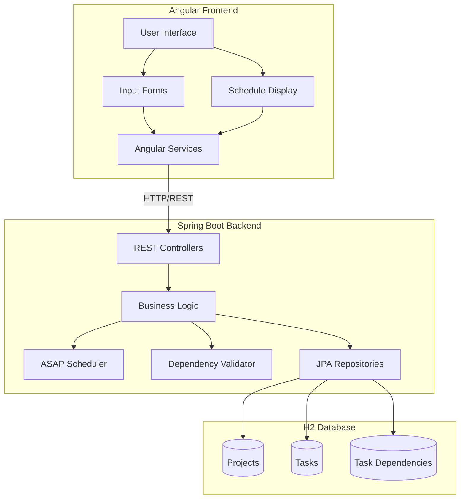
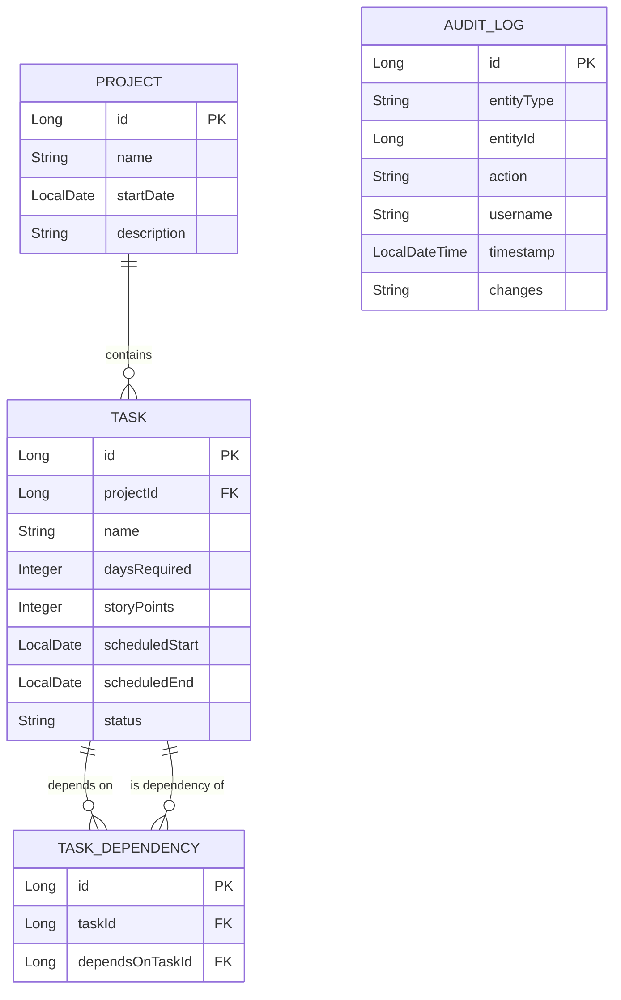
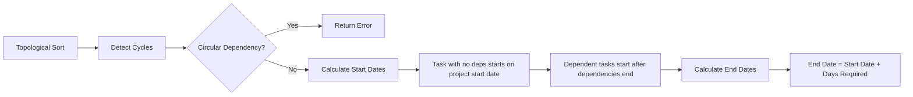
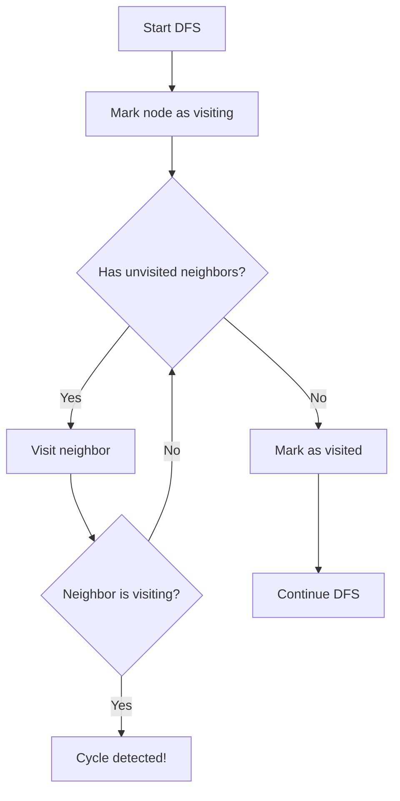
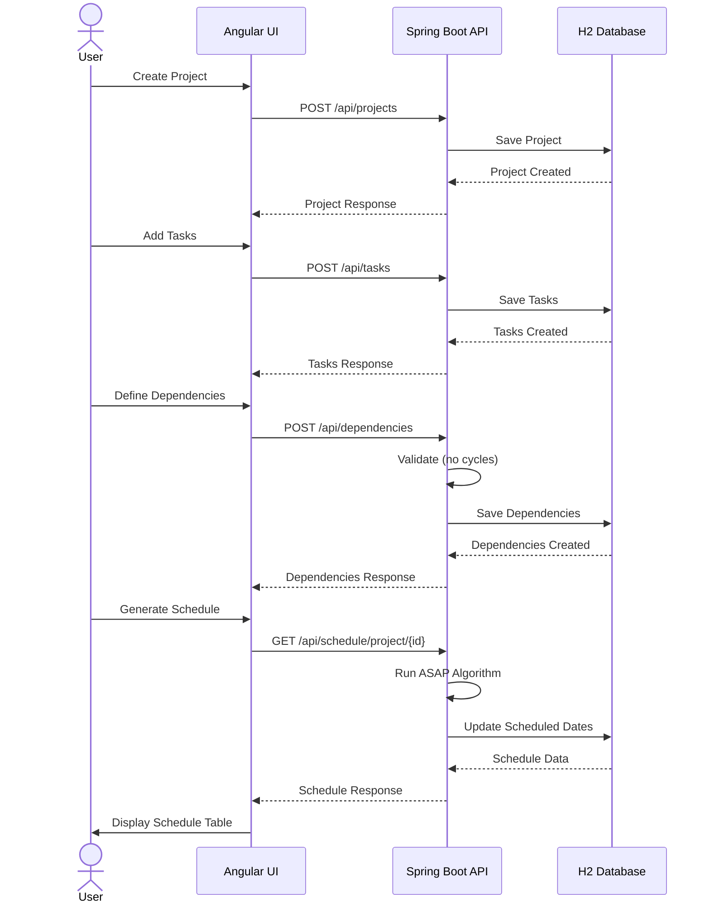

# Project Scheduler - Technical Plan

## Overview
A web-based project scheduling application built with Angular frontend and Spring Boot backend, using H2 database for data persistence. The application schedules tasks using the ASAP (As Soon As Possible) algorithm with dependency management and circular dependency detection.

## Technology Stack

### Backend
- **Framework**: Spring Boot 3.x
- **Language**: Java 17+
- **Database**: H2 (in-memory)
- **ORM**: Spring Data JPA
- **Build Tool**: Maven or Gradle
- **API**: RESTful endpoints
- **AOP**: Spring AOP for logging and audit trail
- **Logging**: SLF4J with Logback

### Frontend
- **Framework**: Angular 19+
- **Language**: TypeScript
- **UI Library**: Angular Material (recommended)
- **HTTP Client**: Angular HttpClient
- **Forms**: Reactive Forms

## System Architecture



## Data Model



## Core Features

### 1. Input Management
- **Project Creation**: Name, start date, description
- **Task Creation**: Name, days required, story points (Fibonacci: 1, 2, 3, 5, 8, 13), project assignment
- **Dependency Management**: Define which tasks depend on others
- **Validation**: Prevent circular dependencies and story point values

### 2. Scheduling Algorithm (ASAP)
The ASAP algorithm schedules tasks to start as soon as their dependencies are complete:



**Algorithm Steps**:
1. Perform topological sort on task dependency graph
2. Detect circular dependencies (if cycle exists, reject)
3. For each task in topological order:
   - If no dependencies: `startDate = projectStartDate`
   - If has dependencies: `startDate = max(dependency.endDate) + 1 day`
   - Calculate: `endDate = startDate + daysRequired - 1`

### 3. Output Display
Tabular schedule showing:
- Task name
- Project name
- Dependencies
- Days required
- Story points (effort estimation)
- Scheduled start date
- Scheduled end date
- Duration

### 4. Logging and Audit Trail
Using Spring AOP (Aspect-Oriented Programming) to automatically log:
- All CRUD operations (Create, Read, Update, Delete)
- User actions and timestamps
- Data changes (before/after values)
- Schedule calculations and validations
- Error occurrences and stack traces

**AOP Implementation**:
- `@Loggable` annotation for method-level logging
- `@Auditable` annotation for audit trail tracking
- Aspects intercept service layer methods
- Automatic capture of method parameters and return values
- Store audit logs in database for compliance and debugging

## API Endpoints

### Project Endpoints
- `POST /api/projects` - Create project
- `GET /api/projects` - List all projects
- `GET /api/projects/{id}` - Get project details
- `PUT /api/projects/{id}` - Update project
- `DELETE /api/projects/{id}` - Delete project

### Task Endpoints
- `POST /api/tasks` - Create task
- `GET /api/tasks` - List all tasks
- `GET /api/tasks/{id}` - Get task details
- `GET /api/tasks/project/{projectId}` - Get tasks by project
- `PUT /api/tasks/{id}` - Update task
- `DELETE /api/tasks/{id}` - Delete task

### Dependency Endpoints
- `POST /api/dependencies` - Create dependency
- `GET /api/dependencies/task/{taskId}` - Get task dependencies
- `DELETE /api/dependencies/{id}` - Delete dependency
- `POST /api/dependencies/validate` - Validate for circular dependencies

### Schedule Endpoints
- `GET /api/schedule/project/{projectId}` - Generate schedule for project
- `GET /api/schedule/calculate` - Calculate schedule with validation

## Frontend Components

### Component Structure
```
src/app/
├── components/
│   ├── project-form/
│   ├── task-form/
│   ├── dependency-manager/
│   └── schedule-view/
├── services/
│   ├── project.service.ts
│   ├── task.service.ts
│   ├── dependency.service.ts
│   └── schedule.service.ts
├── models/
│   ├── project.model.ts
│   ├── task.model.ts
│   ├── dependency.model.ts
│   └── schedule.model.ts
└── app.component.ts
```

## Circular Dependency Detection

Using Depth-First Search (DFS) to detect cycles:



## Validation Rules

1. **Task Validation**:
   - Name is required
   - Days required must be > 0
   - Story points must be valid Fibonacci number (1, 2, 3, 5, 8, 13, 21, etc.)
   - Must belong to a project

2. **Dependency Validation**:
   - Cannot depend on itself
   - Cannot create circular dependencies
   - Both tasks must exist
   - Both tasks must belong to same project

3. **Project Validation**:
   - Name is required
   - Start date cannot be in the past
   - Must have at least one task to generate schedule

## User Workflow



## Testing Strategy

### Backend Tests
- **Unit Tests**: Scheduling algorithm, circular dependency detection
- **Integration Tests**: REST API endpoints, database operations
- **Test Data**: Sample projects with various dependency scenarios

### Frontend Tests
- **Component Tests**: Form validation, user interactions
- **Service Tests**: API communication, error handling
- **E2E Tests**: Complete workflow from input to schedule generation

## Sample Data Structure

### Input Example
```json
{
  "project": {
    "name": "Website Redesign",
    "startDate": "2026-08-01"
  },
  "tasks": [
    {
      "name": "Design Mockups",
      "daysRequired": 5,
      "storyPoints": 5,
      "dependencies": []
    },
    {
      "name": "Frontend Development",
      "daysRequired": 10,
      "storyPoints": 13,
      "dependencies": ["Design Mockups"]
    },
    {
      "name": "Backend API",
      "daysRequired": 8,
      "storyPoints": 8,
      "dependencies": ["Design Mockups"]
    },
    {
      "name": "Integration Testing",
      "daysRequired": 3,
      "storyPoints": 3,
      "dependencies": ["Frontend Development", "Backend API"]
    }
  ]
}
```

### Output Example
```
| Task Name            | Dependencies              | Days | Story Points | Start Date | End Date   |
|---------------------|---------------------------|------|--------------|------------|------------|
| Design Mockups      | None                      | 5    | 5            | 2026-08-01 | 2026-08-05 |
| Frontend Development| Design Mockups            | 10   | 13           | 2026-08-06 | 2026-08-15 |
| Backend API         | Design Mockups            | 8    | 8            | 2026-08-06 | 2026-08-13 |
| Integration Testing | Frontend Dev, Backend API | 3    | 3            | 2026-08-16 | 2026-08-18 |
```

## Project Structure

### Backend Structure
```
project-scheduler-backend/
├── src/main/java/com/scheduler/
│   ├── ProjectSchedulerApplication.java
│   ├── controller/
│   │   ├── ProjectController.java
│   │   ├── TaskController.java
│   │   ├── DependencyController.java
│   │   └── ScheduleController.java
│   ├── service/
│   │   ├── ProjectService.java
│   │   ├── TaskService.java
│   │   ├── DependencyService.java
│   │   └── SchedulingService.java
│   ├── repository/
│   │   ├── ProjectRepository.java
│   │   ├── TaskRepository.java
│   │   └── TaskDependencyRepository.java
│   ├── model/
│   │   ├── Project.java
│   │   ├── Task.java
│   │   ├── TaskDependency.java
│   │   └── AuditLog.java
│   ├── dto/
│   │   ├── ProjectDTO.java
│   │   ├── TaskDTO.java
│   │   └── ScheduleDTO.java
│   ├── aspect/
│   │   ├── LoggingAspect.java
│   │   └── AuditAspect.java
│   ├── annotation/
│   │   ├── Loggable.java
│   │   └── Auditable.java
│   └── exception/
│       ├── CircularDependencyException.java
│       └── ValidationException.java
├── src/main/resources/
│   ├── application.properties
│   └── data.sql (optional seed data)
└── pom.xml / build.gradle
```

### Frontend Structure
```
project-scheduler-frontend/
├── src/app/
│   ├── components/
│   │   ├── project-form/
│   │   ├── task-form/
│   │   ├── dependency-manager/
│   │   ├── schedule-view/
│   │   └── navigation/
│   ├── services/
│   │   ├── project.service.ts
│   │   ├── task.service.ts
│   │   ├── dependency.service.ts
│   │   └── schedule.service.ts
│   ├── models/
│   │   ├── project.model.ts
│   │   ├── task.model.ts
│   │   ├── dependency.model.ts
│   │   └── schedule.model.ts
│   ├── app.component.ts
│   ├── app.routes.ts
│   └── app.config.ts
├── angular.json
├── package.json
└── tsconfig.json
```

## Development Phases

### Phase 1: Backend Foundation
- Set up Spring Boot project
- Configure H2 database
- Create domain models and repositories
- Implement basic CRUD operations

### Phase 2: Scheduling Logic
- Implement topological sort algorithm
- Add circular dependency detection
- Create ASAP scheduling algorithm
- Add comprehensive validation

### Phase 3: REST API
- Create REST controllers
- Implement all endpoints
- Add error handling
- Write API documentation

### Phase 4: Frontend Setup
- Initialize Angular project
- Set up Angular Material
- Create service layer
- Define TypeScript models

### Phase 5: UI Components
- Build project form
- Build task form with dependency selection
- Create schedule display table
- Add navigation and routing

### Phase 6: Integration & Testing
- Connect frontend to backend
- Write unit tests
- Write integration tests
- Perform end-to-end testing

### Phase 7: Polish & Documentation
- Style the application
- Add loading states and error messages
- Write README and setup instructions
- Create sample data for demo

## Key Implementation Notes

1. **Topological Sort**: Use Kahn's algorithm or DFS-based approach
2. **Date Calculation**: Use Java's `LocalDate` for date arithmetic
3. **Validation**: Validate on both frontend and backend
4. **Error Handling**: Return meaningful error messages for circular dependencies
5. **UI/UX**: Use Angular Material for consistent, professional design
6. **CORS**: Configure CORS in Spring Boot for local development
7. **AOP Logging**: Use `@Around` advice to intercept and log method executions
8. **Audit Trail**: Store all changes with timestamp, user, and before/after values
9. **Story Points**: Validate against Fibonacci sequence (1, 2, 3, 5, 8, 13, 21, etc.)
10. **Logging Levels**: Use appropriate levels (INFO, DEBUG, ERROR) for different operations

## Next Steps

Once this plan is approved, we can switch to Code mode to begin implementation following the todo list in order.